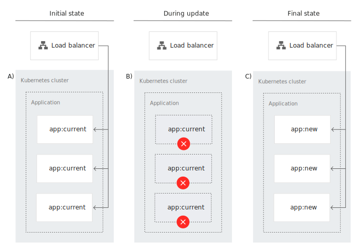
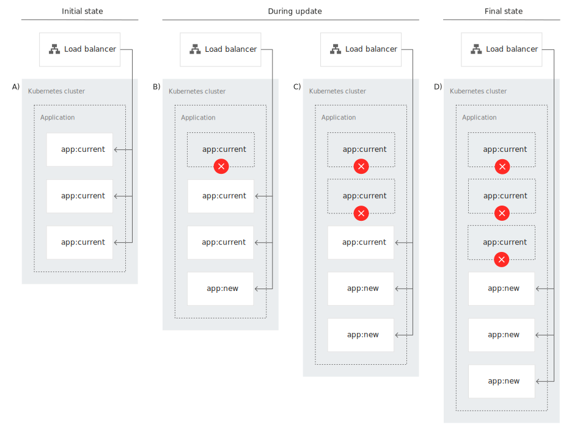
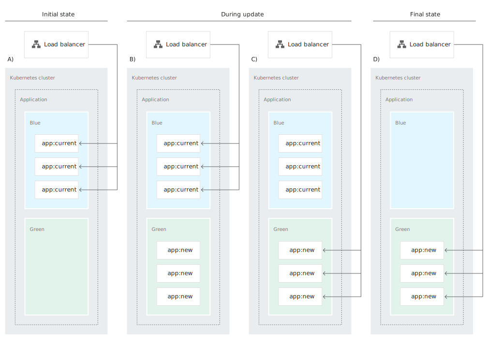
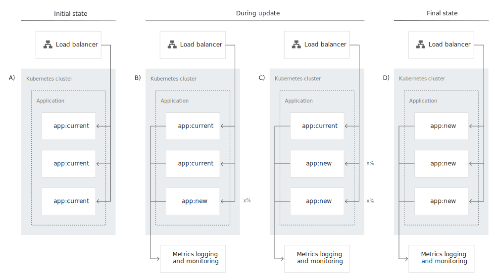
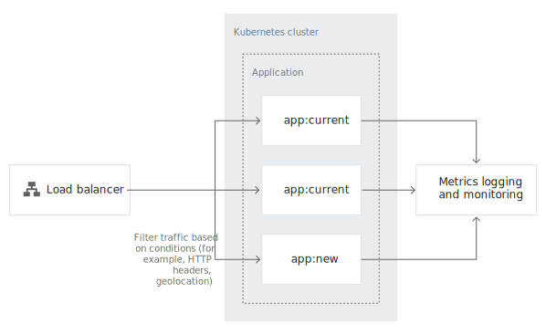
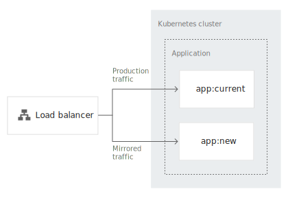

# Implementing deployment and testing strategies

[toc]


## Creating a Kubernetes Cluster


## Cloning the Git repository
```
git clone https://github.com/GoogleCloudPlatform/gke-deployment-testing-strategies/
cd gke-deployment-testing-strategies
```


## Testing your container images

```
docker run --name curr -d \
    -p 9001:8080 gcr.io/cloud-solutions-images/app:current && \
    while ! curl -s http://localhost:9001/version; \
    do sleep 5; done

[...]
{"id":1,"content":"current"}
```

```
docker run --name new -d \
    -p 9002:8080 gcr.io/cloud-solutions-images/app:new && \
    while ! curl -s http://localhost:9002/version; \
    do sleep 5; done

[...]
{"id":2,"content":"new"}
```

Stop the running containers:

```
docker rm -f curr && docker rm -f new
```


## Deploying the new application version

### Perform a recreate deployment

현재 버전의 application을 termination, 새로운 버전을 roll out



Test 

* 현재 버전 application 배포(app:current)
* 트래픽 발생하면서 애플리케이션 테스트
* 새로운 버전 application 배포(app:new)
* 현재 버전이 터미네이션되고 트래픽이 (app:current)에서 (app:new)로 스위칭 확인

#### Deploy the current version

```
# Deploy the current application version:
master $ kubectl apply -f recreate/deployment-old.yaml
deployment.apps/app created

# Verify that the deployment is created successfully:
master $ kubectl rollout status deploy app
deployment "app" successfully rolled out

# Create a Kubernetes service that serves external traffic:
master $ kubectl apply -f recreate/service.yaml
service/app created

# Verify that the service is created successfully:
master $ kubectl get svc/app -w
NAME   TYPE           CLUSTER-IP     EXTERNAL-IP   PORT(S)          AGE
app    LoadBalancer   10.105.30.48   <pending>     8080:30108/TCP   16s
app    LoadBalancer   10.105.30.48   172.17.0.66   8080:30108/TCP   4m40s
```


#### Test the deployment

Terminal #2 - 배포된 애플리케이션에 지속적으로 트래픽 발생

```
# Get the load balancer IP address:
master $ SERVICE_IP=$(kubectl get svc app \
>     -o jsonpath="{.status.loadBalancer.ingress[0].ip}")

# Generate traffic against the deployed application:
master $ while(true); do \
>     curl "http://${SERVICE_IP}:8080/version"; echo; sleep 2; done
{"id":1,"content":"current"}
{"id":1,"content":"current"}
[...]
```


#### Deploy the new version

Terminal #1 

새로운 버전의 애플리케이션 배포

```
master $ kubectl apply -f recreate/deployment-new.yaml
```


Terminal #2

다운타임이 발생하며 current -> new  스위칭 확인

```
{"id":1,"content":"current"}
{"id":1,"content":"current"}
{"id":1,"content":"current"}
curl: (7) Failed to connect to 172.17.0.66 port 8080: Connection refused

curl: (7) Failed to connect to 172.17.0.66 port 8080: Connection refused

[...]

curl: (7) Failed to connect to 172.17.0.66 port 8080: Connection refused

curl: (7) Failed to connect to 172.17.0.66 port 8080: Connection refused

{"id":2,"content":"new"}
{"id":2,"content":"new"}
{"id":2,"content":"new"}
```


Clean up the resources

```
kubectl delete -f recreate/ --ignore-not-found
```


### Perform a rolling update deployment

현재 버전에서 새로운 버전으로 점차 이동 

**rolling update는 kubernetes deployment 기본 설정**




Test

* 현재 버전 application 배포(app:current)
* 트래픽 발생하면서 애플리케이션 테스트
* 새로운 버전 application 배포(app:new)
* 현재 버전이 터미네이션되고 트래픽이 (app:current)에서 (app:new)로 스위칭 확인

#### Deploy the current version
```
# Deploy the current application version:
kubectl apply -f rollingupdate/deployment-old.yaml

# Verify that the deployment is created successfully:
kubectl rollout status deploy app

# Create a Kubernetes service to serve external traffic:
kubectl apply -f rollingupdate/service.yaml

# Verify that the service is created successfully:
kubectl get svc/app -w

NAME   TYPE           CLUSTER-IP       EXTERNAL-IP      PORT(S)          AGE
app    LoadBalancer   172.18.116.126   192.168.56.242   8080:32620/TCP   23s
```


#### Test the deployment

Terminal #2 - 배포된 애플리케이션에 지속적으로 트래픽 발생

```
# Get the load balancer IP address:
$ SERVICE_IP=$(kubectl get svc app \
>     -o jsonpath="{.status.loadBalancer.ingress[0].ip}")

# Generate traffic against the deployed application:
$ while(true); do \
>     curl "http://${SERVICE_IP}:8080/version"; echo; sleep 2; done
{"id":1,"content":"current"}
{"id":1,"content":"current"}
[...]
```

#### Deploy the new version

Terminal #1
```
kubectl apply -f rollingupdate/deployment-new.yaml
```


Terminal #2
```
[...]
{"id":2,"content":"new"}
{"id":1,"content":"current"}
{"id":1,"content":"current"}
{"id":2,"content":"new"}
{"id":2,"content":"new"}
{"id":2,"content":"new"}
{"id":2,"content":"new"}
{"id":2,"content":"new"}
{"id":2,"content":"new"}
{"id":2,"content":"new"}
{"id":2,"content":"new"}
{"id":1,"content":"current"}
{"id":2,"content":"new"}
{"id":2,"content":"new"}
{"id":2,"content":"new"}
{"id":2,"content":"new"}
{"id":2,"content":"new"}
{"id":1,"content":"current"}
{"id":2,"content":"new"}
{"id":2,"content":"new"}
{"id":2,"content":"new"}
[...]
```

Clean up the resources
```
kubectl delete -f rollingupdate/ --ignore-not-found
```


### Perform a blue/green deployment
블루/그린 배포는 현재 버전을 그대로 두고 새 버전을 추가로 배포하여 테스트 후 스위칭하는 방식.



Test

* 현재 버전 application 배포(app:current)
* 트래픽 발생하면서 애플리케이션 테스트
* 현재 버전은 그대로 두고, 새로운 버전 application 배포(app:new)
* 트래픽을 Load balancer 레이어에서 service selector를 통해 (app:current)에서 (app:new)로 스위칭

#### Deploy the current version (blue deployment)
```
# Deploy the current application version:
$ kubectl apply -f bluegreen/deployment-old.yaml
deployment.apps/app-01 created

# Verify that the deployment is created successfully:
$ kubectl rollout status deploy app-01
Waiting for deployment "app-01" rollout to finish: 0 of 1 updated replicas are available...
deployment "app-01" successfully rolled out

# Create a Kubernetes service to serve external traffic:
$ kubectl apply -f bluegreen/service-old.yaml
service/app created

# Verify that the service is created successfully:
$ kubectl get svc/app -w
NAME   TYPE           CLUSTER-IP     EXTERNAL-IP      PORT(S)          AGE
app    LoadBalancer   172.18.34.97   192.168.56.242   8080:32583/TCP   4s
```


#### Test the deployment
Terminal #2
```
# Get the load balancer IP address:
$ SERVICE_IP=$(kubectl get svc app \
>     -o jsonpath="{.status.loadBalancer.ingress[0].ip}")

# Generate traffic against the deployed application:
$ while(true); \
>     do curl "http://${SERVICE_IP}:8080/version"; echo; sleep 2; done

{"id":1,"content":"current"}
{"id":1,"content":"current"}
{"id":1,"content":"current"}
{"id":1,"content":"current"}
{"id":1,"content":"current"}
[...]
```


#### Deploy the new version (green deployment)
Terminal #1
```
# Deploy the new application version:
$ kubectl apply -f bluegreen/deployment-new.yaml
deployment.apps/app-02 created

# Verify that the deployment is created successfully:
$ kubectl rollout status deploy app-02
Waiting for deployment "app-02" rollout to finish: 0 of 1 updated replicas are available...
deployment "app-02" successfully rolled out
```


#### Switch traffic from the blue deployment to the green deployment
서비스 이름은 변경없이 selector만 demo-app-v1에서 demo-app-v2로 변경해서 배포하면,
트래픽을 app:current에서 app:new로 바로 스위칭 할 수 있다.

```
$ cd bluegreen

$ diff service-old.yaml service-new.yaml
21c21
<     app: demo-app-v1
---
>     app: demo-app-v2

$ diff deployment-old.yaml deployment-new.yaml
18c18
<   name: app-01
---
>   name: app-02
22c22
<       app: demo-app-v1
---
>       app: demo-app-v2
26c26
<          app: demo-app-v1
---
>          app: demo-app-v2
30c30
<           image: gcr.io/cloud-solutions-images/app:current
---
>           image: gcr.io/cloud-solutions-images/app:new

$ cd ..
```

Terminal #1
```
# Update the service selector to point to the new version:
$ kubectl apply -f bluegreen/service-new.yaml
service/app configured
```

서비스가 업데이트되면 트랜잭션 요청이 새로운 버전으로 스위칭된다.  
Terminal #2
```
{"id":1,"content":"current"}
{"id":1,"content":"current"}
{"id":1,"content":"current"}
{"id":1,"content":"current"}
{"id":2,"content":"new"}
{"id":2,"content":"new"}
{"id":2,"content":"new"}
```


## Testing the new application version

### Perform a canary test
카나리 테스트는 새 버전의 애플리케이션을 특정%만큼 배포하고 그 성능을 테스트 하는 방법



Test

* 현재 버전 application 배포(app:current)
* 외부 트래픽 발생을 위해 Istio 사용
* 현재 버전은 그대로 두고, 새로운 버전 application 배포(app:new)
* Istio를 통해 미리 정해진 비중대로 트래픽을  (app:current)와 (app:new)에 나누어 보냄

#### Deploy the current version

Deploy the current version of the application:

```
kubectl apply -f canary/deployment-old.yaml
```


Verify that the deployment is created successfully:

```
kubectl rollout status deploy app-01

deployment "app-01" successfully rolled out
```


Deploy the Istio resources:

```
kubectl apply \
    -f canary/gateway.yaml \
    -f canary/virtualservice.yaml
```


#### Test the deployment

Terminal #2

Get the Istio ingress gateway IP address:

```
SERVICE_IP=$(kubectl get service istio-ingressgateway \
    -n istio-system \
    -o jsonpath="{.status.loadBalancer.ingress[0].ip}")
```

Generate traffic against the deployed application:

```
while(true); \
    do curl "http://${SERVICE_IP}/version"; echo; sleep 2; done
```


#### Deploy the new version (canary)

Terminal #1

deploy the new application version

```
kubectl apply -f canary/deployment-new.yaml
```

Verify that the deployment is created successfully:

```
kubectl rollout status deploy app-02
```


#### Split the traffic

Terminal #1

```
kubectl apply \
    -f canary/destinationrule.yaml \
    -f canary/virtualservice-split.yaml
```


Terminal #2

```
[...]
{"id":1,"content":"current"}
{"id":1,"content":"current"}
{"id":1,"content":"current"}
{"id":1,"content":"current"}
{"id":1,"content":"current"}
{"id":1,"content":"current"}
{"id":1,"content":"current"}
{"id":1,"content":"current"}
{"id":1,"content":"current"}
{"id":1,"content":"current"}
{"id":2,"content":"new"}
{"id":1,"content":"current"}
{"id":2,"content":"new"}
{"id":2,"content":"new"}
{"id":1,"content":"current"}
{"id":1,"content":"current"}
{"id":1,"content":"current"}
[...]
```


Clean up the resources

```
kubectl delete -f canary/ --ignore-not-found
```


### Perform an A/B test
A/B 테스트는 특정 조건(지역,브라우저 버전, 유저 에이전트등) 맞는 새로운 버전의 애플리케이션을 배포하고 테스트 하는 방법


Test

* 현재 버전 application 배포(app:current)
* 현재 버전은 그대로 두고, 새로운 버전 application 배포(app:new)
* Istio를 통해 username이 test인 트래픽을  (app:new)로 보내고 나머지 트래픽을  (app:current)로 보냄

#### 

#### Deploy the current version

Deploy the current application version:

```
kubectl apply -f ab/deployment-old.yaml
```

Verify that the deployment is created successfully:

```
kubectl rollout status deploy app-01
```

Deploy the Istio resources:

```
kubectl apply -f ab/gateway.yaml -f ab/virtualservice.yaml
```


#### Test the deployment

Terminal #2

Get the Istio ingress gateway IP address:

```
SERVICE_IP=$(kubectl get service istio-ingressgateway \
    -n istio-system \
    -o jsonpath="{.status.loadBalancer.ingress[0].ip}")
```

Send a request to the application:

```
curl "http://${SERVICE_IP}/version"
```

The output is similar to the following:

```
{"id":1,"content":"current"} 
```


#### Deploy the new version

Deploy the new version of the application:

```
kubectl apply -f ab/deployment-new.yaml
```


Verify that the deployment is created successfully:

```
kubectl rollout status deploy app-02
```

The output is similar to the following:

```
[...]
deployment "app-02" successfully rolled out
```


#### Split the traffic

Split the [traffic](https://github.com/GoogleCloudPlatform/gke-deployment-testing-strategies/blob/master/ab/virtualservice-split.yaml)  based on the username received in the request's cookie:

```
kubectl apply \
    -f ab/destinationrule.yaml \
    -f ab/virtualservice-split.yaml
```

All requests where `user` is identified as `test` go to the new application version.

Send a request to the application in which `user` is identified as `test`:

```
curl --cookie "user=test" "http://${SERVICE_IP}/version"
```

The output is similar to the following:

```
{"id":2,"content":"new"}
```

Send a request without the cookie:

```
curl "http://${SERVICE_IP}/version"
```

The output is similar to the following:

```
{"id":1,"content":"current"} 
```


Clean up the resources

```
kubectl delete -f ab/ --ignore-not-found
```


### Perform a shadow test

새 버전을 생성하고 기존 애플리케이션으로 들어오는 트래픽을 미러링해서 기존 환경에 영향없이 테스트 하는 방법.



#### Deploy the current version

Deploy the current version of the application:

```
kubectl apply -f shadow/deployment-old.yaml
```


Verify that the deployment is created successfully:

```
kubectl rollout status deploy app-01
```

The output is similar to the following:

```
[...]
deployment "app-01" successfully rolled out
```

Deploy the Istio resources:

```
kubectl apply \
    -f shadow/gateway.yaml \
    -f shadow/virtualservice.yaml
```


#### Test the deployment

Terminal #2

Get the Istio ingress gateway IP address:

```
SERVICE_IP=$(kubectl get service istio-ingressgateway \
    -n istio-system \
    -o jsonpath="{.status.loadBalancer.ingress[0].ip}")
```

Generate traffic against the deployed application:

```
while(true); \
    do curl "http://${SERVICE_IP}/version"; echo; sleep 2; done
```

The output is similar to the following:

```
{"id":1,"content":"current"} {"id":1,"content":"current"} {"id":1,"content":"current"} [...] 
```


#### Deploy the new version

In your original Cloud Shell session, deploy the [new application version](https://github.com/GoogleCloudPlatform/gke-deployment-testing-strategies/blob/master/shadow/deployment-new.yaml):

```
kubectl apply -f shadow/deployment-new.yaml
```


Verify that the deployment is created successfully:

```
kubectl rollout status deploy app-02
```

The output is similar to the following:

```
[...] 
deployment "app-02" successfully rolled out 
```


#### Set up traffic mirroring

Set up [traffic mirroring](https://github.com/GoogleCloudPlatform/gke-deployment-testing-strategies/blob/master/shadow/virtualservice-mirror.yaml)  by updating the Istio resources:

```
kubectl apply -f shadow/virtualservice-mirror.yaml
```

In the terminal where you ran the `curl` command, you see that `app:current` still serves requests, as the following output indicates:

```
{"id":1,"content":"current"}
{"id":1,"content":"current"}
{"id":1,"content":"current"}
[...]
```

Check the new deployment logs to ensure that the traffic is mirrored:

```
kubectl logs -f --tail=3 deployment/app-02
```

The output is similar to the following:

```
2020-02-19 13:16:51.424  INFO 1 --- [nio-8080-exec-7] com.google.springboot.SpringBootDemo     : Serving request from version 2
2020-02-19 13:16:53.749  INFO 1 --- [nio-8080-exec-8] com.google.springboot.SpringBootDemo     : Serving request from version 2
2020-02-19 13:16:54.853  INFO 1 --- [nio-8080-exec-9] com.google.springboot.SpringBootDemo     : Serving request from version 2
2020-02-19 13:16:56.073  INFO 1 --- [io-8080-exec-10] com.google.springboot.SpringBootDemo     : Serving request from version 2
2020-02-19 13:16:58.393  INFO 1 --- [nio-8080-exec-1] com.google.springboot.SpringBootDemo     : Serving request from version 2
2020-02-19 13:17:00.589  INFO 1 --- [nio-8080-exec-2] com.google.springboot.SpringBootDemo     : Serving request from version 2
```


Clean up the resources

```
kubectl delete -f shadow/ --ignore-not-found
```


[Ref](https://cloud.google.com/solutions/implementing-deployment-and-testing-strategies-on-gke#perform_a_bluegreen_deployment)


