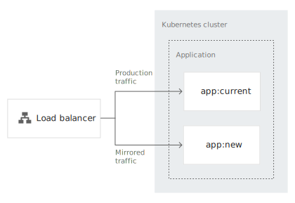

# Implementing deployment and testing strategies

[toc]


## Creating a Kubernetes Cluster


## Cloning the Git repository
```
git clone https://github.com/GoogleCloudPlatform/gke-deployment-testing-strategies/
cd gke-deployment-testing-strategies
```


## Testing your container images

```
docker run --name curr -d \
    -p 9001:8080 gcr.io/cloud-solutions-images/app:current && \
    while ! curl -s http://localhost:9001/version; \
    do sleep 5; done

[...]
{"id":1,"content":"current"}
```

```
docker run --name new -d \
    -p 9002:8080 gcr.io/cloud-solutions-images/app:new && \
    while ! curl -s http://localhost:9002/version; \
    do sleep 5; done

[...]
{"id":2,"content":"new"}
```

Stop the running containers:

```
docker rm -f curr && docker rm -f new
```


## Deploying the new application version

### Perform a recreate deployment

현재 버전의 application을 termination, 새로운 버전을 roll out


Test 

* 현재 버전 application 배포(app:current)
* 트래픽 발생하면서 애플리케이션 테스트
* 새로운 버전 application 배포(app:new)
* 현재 버전이 터미네이션되고 트래픽이 (app:current)에서 (app:new)로 스위칭 확인

#### Deploy the current version

```
# Deploy the current application version:
master $ kubectl apply -f recreate/deployment-old.yaml
deployment.apps/app created

# Verify that the deployment is created successfully:
master $ kubectl rollout status deploy app
deployment "app" successfully rolled out

# Create a Kubernetes service that serves external traffic:
master $ kubectl apply -f recreate/service.yaml
service/app created

# Verify that the service is created successfully:
master $ kubectl get svc/app -w
NAME   TYPE           CLUSTER-IP     EXTERNAL-IP   PORT(S)          AGE
app    LoadBalancer   10.105.30.48   <pending>     8080:30108/TCP   16s
app    LoadBalancer   10.105.30.48   172.17.0.66   8080:30108/TCP   4m40s
```


#### Test the deployment

Terminal #2 - 배포된 애플리케이션에 지속적으로 트래픽 발생

```
# Get the load balancer IP address:
master $ SERVICE_IP=$(kubectl get svc app \
>     -o jsonpath="{.status.loadBalancer.ingress[0].ip}")

# Generate traffic against the deployed application:
master $ while(true); do \
>     curl "http://${SERVICE_IP}:8080/version"; echo; sleep 2; done
{"id":1,"content":"current"}
{"id":1,"content":"current"}
[...]
```


#### Deploy the new version

Terminal #1 

새로운 버전의 애플리케이션 배포

```
master $ kubectl apply -f recreate/deployment-new.yaml
```


Terminal #2

다운타임이 발생하며 current -> new  스위칭 확인

```
{"id":1,"content":"current"}
{"id":1,"content":"current"}
{"id":1,"content":"current"}
curl: (7) Failed to connect to 172.17.0.66 port 8080: Connection refused

curl: (7) Failed to connect to 172.17.0.66 port 8080: Connection refused

[...]

curl: (7) Failed to connect to 172.17.0.66 port 8080: Connection refused

curl: (7) Failed to connect to 172.17.0.66 port 8080: Connection refused

{"id":2,"content":"new"}
{"id":2,"content":"new"}
{"id":2,"content":"new"}
```


Clean up the resources

```
kubectl delete -f recreate/ --ignore-not-found
```


### Perform a rolling update deployment

현재 버전에서 새로운 버전으로 점차 이동 

**rolling update는 kubernetes deployment 기본 설정**


Test

* 현재 버전 application 배포(app:current)
* 트래픽 발생하면서 애플리케이션 테스트
* 새로운 버전 application 배포(app:new)
* 현재 버전이 터미네이션되고 트래픽이 (app:current)에서 (app:new)로 스위칭 확인

#### Deploy the current version
```
# Deploy the current application version:
kubectl apply -f rollingupdate/deployment-old.yaml

# Verify that the deployment is created successfully:
kubectl rollout status deploy app

# Create a Kubernetes service to serve external traffic:
kubectl apply -f rollingupdate/service.yaml

# Verify that the service is created successfully:
kubectl get svc/app -w

NAME   TYPE           CLUSTER-IP       EXTERNAL-IP      PORT(S)          AGE
app    LoadBalancer   172.18.116.126   192.168.56.242   8080:32620/TCP   23s
```


#### Test the deployment

Terminal #2 - 배포된 애플리케이션에 지속적으로 트래픽 발생

```
# Get the load balancer IP address:
$ SERVICE_IP=$(kubectl get svc app \
>     -o jsonpath="{.status.loadBalancer.ingress[0].ip}")

# Generate traffic against the deployed application:
$ while(true); do \
>     curl "http://${SERVICE_IP}:8080/version"; echo; sleep 2; done
{"id":1,"content":"current"}
{"id":1,"content":"current"}
[...]
```

#### Deploy the new version

Terminal #1
```
kubectl apply -f rollingupdate/deployment-new.yaml
```


Terminal #2
```
[...]
{"id":2,"content":"new"}
{"id":1,"content":"current"}
{"id":1,"content":"current"}
{"id":2,"content":"new"}
{"id":2,"content":"new"}
{"id":2,"content":"new"}
{"id":2,"content":"new"}
{"id":2,"content":"new"}
{"id":2,"content":"new"}
{"id":2,"content":"new"}
{"id":2,"content":"new"}
{"id":1,"content":"current"}
{"id":2,"content":"new"}
{"id":2,"content":"new"}
{"id":2,"content":"new"}
{"id":2,"content":"new"}
{"id":2,"content":"new"}
{"id":1,"content":"current"}
{"id":2,"content":"new"}
{"id":2,"content":"new"}
{"id":2,"content":"new"}
[...]
```

Clean up the resources
```
kubectl delete -f rollingupdate/ --ignore-not-found
```


### Perform a blue/green deployment
블루/그린 배포는 현재 버전을 그대로 두고 새 버전을 추가로 배포하여 테스트 후 스위칭하는 방식.


Test

* 현재 버전 application 배포(app:current)
* 트래픽 발생하면서 애플리케이션 테스트
* 현재 버전은 그대로 두고, 새로운 버전 application 배포(app:new)
* 트래픽을 Load balancer 레이어에서 service selector를 통해 (app:current)에서 (app:new)로 스위칭

#### Deploy the current version (blue deployment)
```
# Deploy the current application version:
$ kubectl apply -f bluegreen/deployment-old.yaml
deployment.apps/app-01 created

# Verify that the deployment is created successfully:
$ kubectl rollout status deploy app-01
Waiting for deployment "app-01" rollout to finish: 0 of 1 updated replicas are available...
deployment "app-01" successfully rolled out

# Create a Kubernetes service to serve external traffic:
$ kubectl apply -f bluegreen/service-old.yaml
service/app created

# Verify that the service is created successfully:
$ kubectl get svc/app -w
NAME   TYPE           CLUSTER-IP     EXTERNAL-IP      PORT(S)          AGE
app    LoadBalancer   172.18.34.97   192.168.56.242   8080:32583/TCP   4s
```


#### Test the deployment
Terminal #2
```
# Get the load balancer IP address:
$ SERVICE_IP=$(kubectl get svc app \
>     -o jsonpath="{.status.loadBalancer.ingress[0].ip}")

# Generate traffic against the deployed application:
$ while(true); \
>     do curl "http://${SERVICE_IP}:8080/version"; echo; sleep 2; done

{"id":1,"content":"current"}
{"id":1,"content":"current"}
{"id":1,"content":"current"}
{"id":1,"content":"current"}
{"id":1,"content":"current"}
[...]
```


#### Deploy the new version (green deployment)
Terminal #1
```
# Deploy the new application version:
$ kubectl apply -f bluegreen/deployment-new.yaml
deployment.apps/app-02 created

# Verify that the deployment is created successfully:
$ kubectl rollout status deploy app-02
Waiting for deployment "app-02" rollout to finish: 0 of 1 updated replicas are available...
deployment "app-02" successfully rolled out
```


#### Switch traffic from the blue deployment to the green deployment
Terminal #1
```
# Update the service selector to point to the new version:
$ kubectl apply -f bluegreen/service-new.yaml
service/app configured
```

서비스가 업데이트되면 트랜잭션 요청이 새로운 버전으로 스위칭된다.
Terminal #2
```
{"id":1,"content":"current"}
{"id":1,"content":"current"}
{"id":1,"content":"current"}
{"id":1,"content":"current"}
{"id":2,"content":"new"}
{"id":2,"content":"new"}
{"id":2,"content":"new"}
```


## Testing the new application version

### Perform a canary test


#### Deploy the current version


#### Test the deployment


#### Deploy the new version (canary)


#### Split the traffic


### Perform an A/B test


#### Deploy the current version


#### Test the deployment


#### Deploy the new version


#### Split the traffic


### Perform a shadow test



#### Deploy the current version


#### Test the deployment


#### Deploy the new version


#### Set up traffic mirroring


[Ref](https://cloud.google.com/solutions/implementing-deployment-and-testing-strategies-on-gke#perform_a_bluegreen_deployment)


